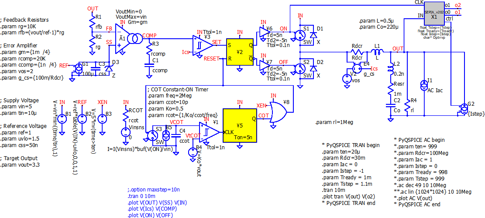
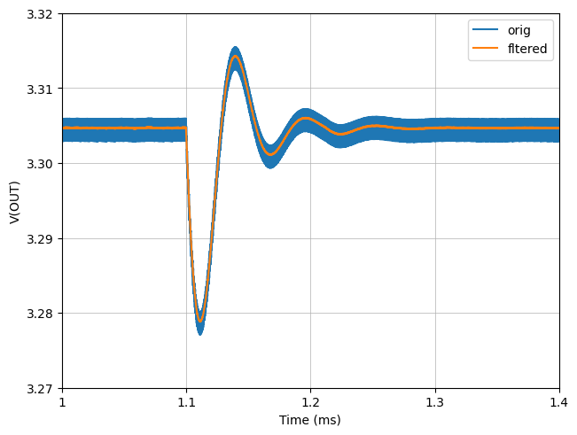
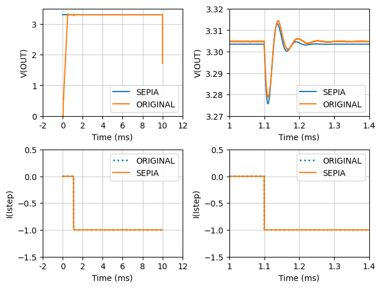
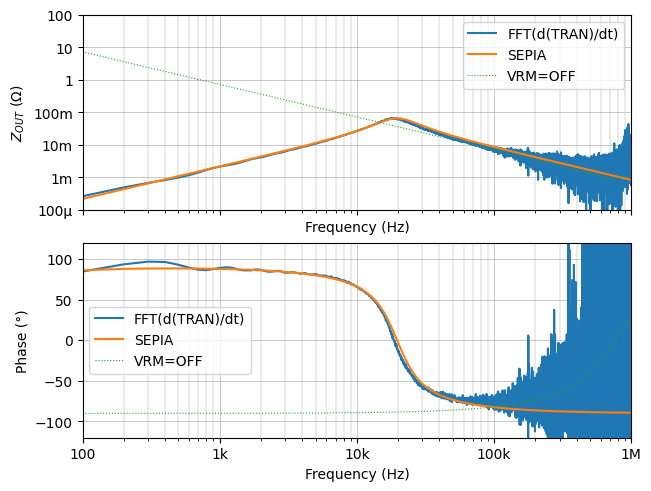
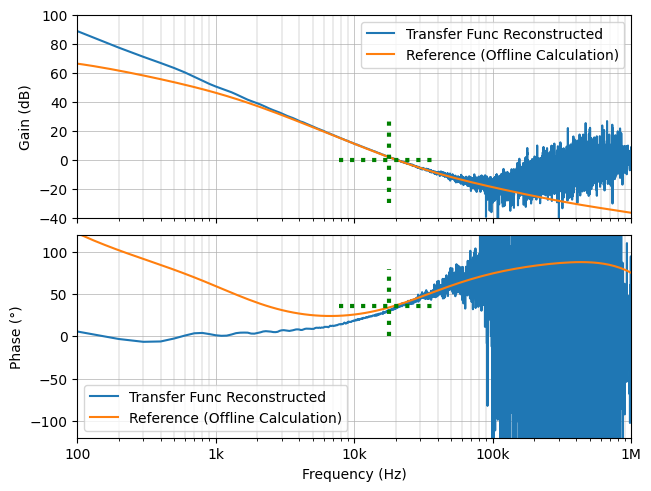

# RF Signal Integrity to Power Integrity:  Part 11 SEPIA on Time-Domain for ZOUT

## Copyright Notice

````
========  SEPIA on QSPICE V202  ========
This "SEPIA" compiled binary (.dll) is Copyright © 2014 Picotest.
All rights reserved.
Please contact info@picotest.com for more information.
========================================
````


This folder contains the 3rd simulation of the  
["part11"](https://www.microwavejournal.com/blogs/32-rf-signal-integrity-to-power-integrity/post/42280-loop-analysis-directly-from-time-domain-waveform-with-sepia) of a series blog/article  
[RF Signal Integrity to Power Integrity](https://www.microwavejournal.com/blogs/32-rf-signal-integrity-to-power-integrity) on  
[Microwave Journal](https://www.microwavejournal.com/).


# Install PyQSPICE First!

In your cmd.exe window.
```
> pip install PyQSPICE
```

# SEPIA@QSPICE Module

This article #11 features [SEPIA@QSPICE](https://github.com/Qorvo/SEPIA_at_QSPICE) module.
Please check the [module usage](https://github.com/Qorvo/SEPIA_at_QSPICE/blob/main/usage.ipynb), [module parameters](https://github.com/Qorvo/SEPIA_at_QSPICE/blob/main/params.md) and [usage from PyQSPICE](https://github.com/Qorvo/SEPIA_at_QSPICE/blob/main/pyparams.md).

## After Python Script

This folder contains resulting files after running the Python Script.
The [**"Sim3"**](https://github.com/Qorvo/QSPICE_on_MWJ/tree/main/Article11/Sim3) folder next to this-folder is "before running script".


## Overview Part 11, Sim #3

In Part-11, throughout [QSPICE](qspice.com) simulations, we review Time-Domain base ZOUT with SEPIA.

In this Sim-3, we apply the SEPIA C++ block to an ideal step-down (buck) regulator.  
By starting from this time-domain ".TRAN" simulation model, WITHOUT making any AC-models, we extract frequency-domain loop infomration.

We do following steps of simulations:

**Section-2:**  
Run a transient ".TRAN" simulation on the schematic below.  
The SEPIA block generates "transient" and "ac" simulation models based on extracted parameters.

**Section-3:**  
Run the transient ".TRAN" simulation based on the SEPIA result from the section-2.

**Section-4:**  
Run an AC ".AC" simulation on the starting schematic below.  
This AC simualtion is for a waveform of VRM=OFF.

**Section-5:**  
Run the AC ".AC" simulation based on the SEPIA result from the section-2:

**Section-6:**  
Compare 3 (three) Zout Curves from
 a. Section-4
 b. Section-5
 c. data-processed Section-2

 **Section-7:**  
 We reconstruct the loop transfer function from "a" and "c" in the section-6.


## 1. Schematic and Netlist

We use below schmatic.


```python
from PIL import Image
Image.open("Buck_SEPIA.sch.png")
```


    

    


```python
from PyQSPICE import clsQSPICE as pqs

import datetime
import re
import subprocess
import math
import cmath

import pandas as pd

import matplotlib as mpl
import matplotlib.pyplot as plt
import matplotlib.patches as pat
from matplotlib.transforms import ScaledTranslation as stran

import numpy as np
from numpy import sin, cos, pi, linspace

fname = "Buck_SEPIA"
run = pqs(fname)
run.qsch2cir()
run.cir4label('ac')
run.cir4label('tran')
```

## 2. Transient Simulation: Execute SEPIA on the BUCK (Step-Down) VRM Model

### 2.1 Run a transient simulation

Now, we run a transient simulation with the step current load.

**NOTE:** This is a long simulation run, see the timestamps below observed at author's environment.

### 2.2 Q-Factor and phase-margin from SEPIA from "2.1"

(Continued from "2.1")
The beauty of SEPIA is that we know the key loop infomration from the simulation above "2.1".
We record the phase-maring here.

After running long operations after "2.3" in this notebook, we confirm that this SEPIA result is matching to the loop information.
In another word, SEPIA finishes its job by this point; all the rest of this notebook is to confirm this SEPIA result from the other method.


```python
Ndata = 1024*1024
run.selectSimLabel('tran', Nline = Ndata, Nbit = 80)

sepiaTran = "_sepia_tran"
sepiaAC = "_sepia_ac"
sepiaLog = "_sepia_log"
run.opt4SEPIA(run.path['tran.cir'], prnPeak = True, Verbose = True,
              fnTran1 = sepiaTran, runTran1 = False, fnAC1 = sepiaAC, runAC1 = False, fnLog = sepiaLog)

print("Simulation started at " + str(datetime.datetime.now()))

run.cir2qraw()
#run.copy2qraw()  #use this line to re-use existing QRAW file

print("Simulation finished at " + str(datetime.datetime.now()))
print("Data Loading started at " + str(datetime.datetime.now()))

v = "V(OUT)"
i = "I(G2)"

dfTRAN = run.LoadQRAW([v,i])
#print(dfTRAN)

print("Data Loading finished at " + str(datetime.datetime.now()))

with open(sepiaLog + ".log") as f: textLog = f.read()
print(textLog)

sepiaPM = float((re.search(r"PM=([^,]+)\(deg\),", textLog)).group(1))
sepiafc = float((re.search(r"f=([^,]+)\(kHz\),", textLog)).group(1)) * 1e3

print("SEPIA: Phase-Margin = " + str(sepiaPM))
print("SEPIA: Unity-Gain Freq = " + str(sepiafc))
```

    Simulation started at 2024-06-23 14:01:55.467739
    Simulation finished at 2024-06-23 14:03:41.563606
    Data Loading started at 2024-06-23 14:03:41.564597
    Data Loading finished at 2024-06-23 14:04:16.736602
    
    SEPIA: Tready=  0.001000, Tstep=  0.001100, Istep= -1.000000, Option:pvl_sepia_log:t1_sepia_tran:a1_sepia_ac:x
    SEPIA: fTran1=_sepia_tran (Auto-Sim: OFF)
    SEPIA: fAC1=_sepia_ac (Auto-Sim: OFF)
    SEPIA: log=_sepia_log
    
    
    ========  SEPIA Result Begin  ========
    SEPIA: Q= 1.54, Icoil/2=1.54e-03, f=17.75(kHz), T=56.34(us), PM=35.73(deg),
    SEPIA: Z=4.26e-02, L=3.45e-07, C=1.91e-04, 
    SEPIA: (sL+Rcoil) // ((1/sC)+Rcap) Modeling
      Rcoil+Rcap=2.76e-02,  Rcoil=1.43e-05,   Rcap=2.76e-02, 
    SEPIA: (sL) // (1/sC) // Rdump Modeling
      Rdump=6.57e-02,  Rcoil=1.43e-05, 
    SEPIA: preAve=3.30e+00, postAve=3.30e+00
    ========  SEPIA Result End    ========
    SEPIA: n= 1.0, Vpk= -0.025592, Tpk= 11.205376(us), Tpp=  0.000000(us), dir=-1
    SEPIA: n= 1.5, Vpk= +0.009780, Tpk= 39.443191(us), Tpp= 56.475630(us), dir=+1
    SEPIA: n= 2.0, Vpk= -0.003339, Tpk= 67.540540(us), Tpp= 56.194699(us), dir=-1
    SEPIA: n= 2.5, Vpk= +0.001514, Tpk= 95.796686(us), Tpp= 56.512291(us), dir=+1
    SEPIA: n= 3.0, Vpk= -0.000607, Tpk=124.416148(us), Tpp= 57.238924(us), dir=-1
    SEPIA: n= 3.5, Vpk= +0.000487, Tpk=152.274028(us), Tpp= 55.715760(us), dir=+1
    SEPIA: n= 4.0, Vpk= +0.000102, Tpk=179.961731(us), Tpp= 55.375407(us), dir=-1
    SEPIA: n= 4.5, Vpk= +0.000246, Tpk=209.294698(us), Tpp= 58.665935(us), dir=+1
    SEPIA: n= 5.0, Vpk= +0.000188, Tpk=239.440040(us), Tpp= 60.290683(us), dir=-1
    SEPIA: n= 5.5, Vpk= +0.000229, Tpk=271.230884(us), Tpp= 63.581688(us), dir=+1
    SEPIA: n= 6.0, Vpk= +0.000195, Tpk=298.918807(us), Tpp= 55.375845(us), dir=-1
    SEPIA: n= 6.5, Vpk= +0.000207, Tpk=322.844404(us), Tpp= 47.851195(us), dir=+1
    SEPIA: n= 7.0, Vpk= +0.000199, Tpk=356.430606(us), Tpp= 67.172404(us), dir=-1
    SEPIA: n= 7.5, Vpk= +0.000220, Tpk=372.983030(us), Tpp= 33.104848(us), dir=+1
    SEPIA: n= 8.0, Vpk= +0.000186, Tpk=413.942833(us), Tpp= 81.919605(us), dir=-1
    SEPIA: n= 8.5, Vpk= +0.000215, Tpk=436.394091(us), Tpp= 44.902518(us), dir=+1
    SEPIA: n= 9.0, Vpk= +0.000212, Tpk=451.792785(us), Tpp= 30.797388(us), dir=-1
    SEPIA: n= 9.5, Vpk= +0.000208, Tpk=464.412842(us), Tpp= 25.240113(us), dir=+1
    SEPIA: n=10.0, Vpk= +0.000205, Tpk=490.626039(us), Tpp= 52.426393(us), dir=-1
    SEPIA: n=10.5, Vpk= +0.000211, Tpk=504.228965(us), Tpp= 27.205852(us), dir=+1
    SEPIA: n=11.0, Vpk= +0.000212, Tpk=528.967211(us), Tpp= 49.476493(us), dir=-1
    SEPIA: n=11.5, Vpk= +0.000201, Tpk=543.553555(us), Tpp= 29.172687(us), dir=+1
    SEPIA: n=12.0, Vpk= +0.000216, Tpk=556.494427(us), Tpp= 25.881744(us), dir=-1
    SEPIA: n=12.5, Vpk= +0.000212, Tpk=577.962365(us), Tpp= 42.935877(us), dir=+1
    SEPIA: n=13.0, Vpk= +0.000212, Tpk=607.125045(us), Tpp= 58.325360(us), dir=-1
    SEPIA: n=13.5, Vpk= +0.000214, Tpk=634.491639(us), Tpp= 54.733187(us), dir=+1
    SEPIA: n=14.0, Vpk= +0.000213, Tpk=656.772098(us), Tpp= 44.560918(us), dir=-1
    SEPIA: n=14.5, Vpk= +0.000207, Tpk=669.392162(us), Tpp= 25.240130(us), dir=+1
    SEPIA: n=15.0, Vpk= +0.000210, Tpk=686.756942(us), Tpp= 34.729560(us), dir=-1
    SEPIA: n=15.5, Vpk= +0.000235, Tpk=719.039381(us), Tpp= 64.564877(us), dir=+1
    SEPIA: n=16.0, Vpk= +0.000202, Tpk=738.370561(us), Tpp= 38.662361(us), dir=-1
    SEPIA: n=16.5, Vpk= +0.000216, Tpk=773.602306(us), Tpp= 70.463490(us), dir=+1
    SEPIA: n=17.0, Vpk= +0.000199, Tpk=808.171935(us), Tpp= 69.139259(us), dir=-1
    SEPIA: n=17.5, Vpk= +0.000204, Tpk=836.521658(us), Tpp= 56.699446(us), dir=+1
    SEPIA: n=18.0, Vpk= +0.000216, Tpk=844.547259(us), Tpp= 16.051203(us), dir=-1
    
    
    ========  SEPIA on QSPICE V202  ========
    This "SEPIA" compiled binary (.dll) is Copyright ﾂｩ 2014 Picotest.
    All rights reserved.
    Please contact info@picotest.com for more information.
    ========================================
    
    SEPIA: Phase-Margin = 35.73
    SEPIA: Unity-Gain Freq = 17750.0
    

### 2.3 Filter-out switching ripple

For a better results of FFT, we take a moving-average of our FULL transient result.


```python
# We run the FuLL tran-sim for 10ms, and we have 1-meg (1024 x 1024) data lines, so the sampling period is ~10ns.
# Then, this sw-reg has 2MHz operation, which is ~500ns.
# In total, one (1) sw-reg switching-period is around 50 data points.
# This 50 data-point moving average eliminates switching ripple.
ra = np.ones(50) / 50

npTRANv = dfTRAN[v].to_numpy()
npTRANi = dfTRAN[i].to_numpy()
npTRANt = dfTRAN["Time"].to_numpy()

npTRANf = np.convolve(npTRANv, ra, mode="same")

plt.close('all')

fig, ax = plt.subplots(1, 1, sharex=True, constrained_layout=True)

ax.plot(npTRANt, npTRANv, label="orig")
ax.plot(npTRANt, npTRANf, label="fltered")

ax.legend()

run.PrepTimePlot(ax, "Time", r"V(OUT)", [1e-3, 1.4e-3], [3.27,3.32], "")
run.PrepTimePlot(ax, "Time", r"V(OUT)", "auto", "auto", "")

plt.savefig("Buck_SEPIA.tran.png", format='png', bbox_inches='tight')

plt.show()
```


    

    


## 3. Run SEPIA Extracted Transient Model

We run and compare the SEPIA result for transient response.

**NOTE:** We use the SHORT transient simulation result here.


```python
run2 = pqs(sepiaTran)

with open(run2.path['cir'], encoding='SJIS') as f: print(f.read())
#with open(sepiaLog + ".log") as f: print(f.read())

print("############################################################################################")

run2.setNline(1024 * 16)
run2.setNbit(80)
print("Simulation started at " + str(datetime.datetime.now()))
run2.cir2qraw()
#run2.copy2qraw()  #use this line to re-use existing QRAW file
print("Simulation finished at " + str(datetime.datetime.now()))
print("Data Loading started at " + str(datetime.datetime.now()))

v2 = "V(SEPIA_MODEL_FITTING)"
i2 = "I(Istep)"

dfTRAN2 = run2.LoadQRAW([v2,i2])
#print(dfTRAN2)
print("Data Loading finished at " + str(datetime.datetime.now()))

plt.close('all')

fig, ax = plt.subplots(2, 2, constrained_layout=True)

for n in [0, 1]:
    #dfTRAN.plot(ax=ax[0,n], x="Time", y=v, label="ORIGINAL", linestyle="dotted", linewidth=2)
    dfTRAN.plot(ax=ax[1,n], x="Time", y=i, label="ORIGINAL", linestyle="dotted", linewidth=2)
    dfTRAN2.plot(ax=ax[0,n], x="Time", y=v2, label="SEPIA")
    dfTRAN2.plot(ax=ax[1,n], x="Time", y=i2, label="SEPIA")
    ax[0,n].plot(npTRANt, npTRANf, label="ORIGINAL")
    ax[0,n].legend()

run2.PrepTimePlot(ax[0,0], "Time", r"V(OUT)", "auto", [0,3.5], "")
run2.PrepTimePlot(ax[1,0], "Time", r"I(Istep)", "auto", [-1.5,0.5], "")
run2.PrepTimePlot(ax[0,1], "Time", r"V(OUT)",   [1.05e-3,1.35e-3], [3.27,3.32], "")
run2.PrepTimePlot(ax[1,1], "Time", r"I(Istep)", [1.05e-3,1.35e-3], [-1.5,0.5], "")

plt.savefig("Buck_SEPIA.tran2.png", format='png', bbox_inches='tight')

plt.show()
```

    * This file is generated by the SEPIA on QSPICE v202.
    Vbias N03 0   3.30419480e+00
    Rdcr N03 N02   1.43401578e-05
    Lout N02 SEPIA_MODEL_FITTING   3.45485452e-07
    Cout 0 SEPIA_MODEL_FITTING   1.90549433e-04
    
    Rdump 0 SEPIA_MODEL_FITTING   6.56882907e-02
    Istep 0 SEPIA_MODEL_FITTING pwl 0 0   1.10000000e-03 0   1.10000100e-03  -1.00000000e+00
    .TRAN 0   1.00000000e-02 0 10n
    .PLOT TRAN V(SEPIA_MODEL_FITTING)
    
    ############################################################################################
    Simulation started at 2024-06-23 14:09:10.569415
    Simulation finished at 2024-06-23 14:09:13.507300
    Data Loading started at 2024-06-23 14:09:13.509952
    Data Loading finished at 2024-06-23 14:09:15.690379
    


    

    


## 4. AC Simulation: on the original model

We run an AC simulation by disabling the Buck VRM.


```python
run.selectSimLabel('ac', Nline = 1024*4, Nbit = 80)

print("Simulation started at " + str(datetime.datetime.now()))
run.cir2qraw()
print("Simulation finished at " + str(datetime.datetime.now()))
print("Data Loading started at " + str(datetime.datetime.now()))

vac = "V(out)"
iac = "I(Iac)"

dfAC = run.LoadQRAW([vac])
print("Data Loading finished at " + str(datetime.datetime.now()))

#print(dfAC)
npACoffv = dfAC[vac].to_numpy()
npACofff = dfAC["Freq"].to_numpy()
```

    Simulation started at 2024-06-23 14:09:35.863549
    Simulation finished at 2024-06-23 14:09:36.309145
    Data Loading started at 2024-06-23 14:09:36.309145
    Data Loading finished at 2024-06-23 14:09:38.049785
    

## 5. Run SEPIA Extracted AC Model

We run the SEPIA result of AC model.


```python
run3 = pqs(sepiaAC)

run3.setNline(1024*4)
run3.setNbit(80)
run3.cir2qraw()

v3 = "V(SEPIA_MODEL_FITTING)"
i3 = "I(Iac)"

print("Simulation started at " + str(datetime.datetime.now()))

dfAC2 = run3.LoadQRAW([v3,i3])

print("Simulation finished at " + str(datetime.datetime.now()))
print("Data Loading started at " + str(datetime.datetime.now()))

npAConv = dfAC2[v3].to_numpy()
npAConf = dfAC2["Freq"].to_numpy()

print("Data Loading finished at " + str(datetime.datetime.now()))
```

    Simulation started at 2024-06-23 14:09:41.786800
    Simulation finished at 2024-06-23 14:09:42.811337
    Data Loading started at 2024-06-23 14:09:42.811337
    Data Loading finished at 2024-06-23 14:09:42.811337
    

## 6. Compare Zout Curves

We compare below 3 output impedance curves.

1. VRM = OFF Zout curve from the original schematic
2. SEPIA extracted Zout curve
3. L( ddt( Vout_step_response )):  Laplace transforming derivative of Vout step response


```python
# Masking ramp-up waveform of VRM
# copy Vout @ 10%-point into all Vout data from 0 to 10%
npTRANf[0:int(Ndata/10)] = npTRANf[int(Ndata/10)]
npTRANf[int(Ndata*98/100):] = npTRANf[int(Ndata*98/100)]
#print(dfTRAN)

#print(npTRANf)
#print(npTRANi)

#dfVo = dfTRAN[v].diff().iloc[1:]
#dfIo = dfTRAN[i].diff().iloc[1:]
npVo = np.diff(npTRANf)
npIo = np.diff(npTRANi)
step = dfTRAN.iloc[1,0]

#print(npVo)
#print(npIo)

ftVo = (np.fft.fft(npVo))[0:int(Ndata/2)]
ftIo = (np.fft.fft(npIo))[0:int(Ndata/2)]
freq = (np.fft.fftfreq(Ndata,d=step))[0:int(Ndata/2)]

#print(ftVo)
#print(ftIo)

ZoFFT = (ftVo / ftIo)

absZfft = 20*np.log10(np.abs(ZoFFT))
angZfft = np.angle(ZoFFT) / np.pi * 180

##########################################

ZoSEPIA = np.interp(freq, npAConf, npAConv)

absZsepia = 20*np.log10(np.abs(ZoSEPIA))
angZsepia = np.angle(ZoSEPIA) / np.pi * 180

##########################################

absZoff = 20*np.log10(np.abs(npACoffv))
angZoff = np.angle(npACoffv) / np.pi * 180

##########################################

plt.close('all')

fig, (axT, axB) = plt.subplots(2, 1, sharex=True, constrained_layout=True)

axT.plot(freq, absZfft, label="FFT(d(TRAN)/dt)")
axB.plot(freq, angZfft, label="FFT(d(TRAN)/dt)")

axT.plot(freq, absZsepia, label="SEPIA")
axB.plot(freq, angZsepia, label="SEPIA")

axT.plot(npACofff, absZoff, label="VRM=OFF", linestyle="dotted", linewidth=0.8)
axB.plot(npACofff, angZoff, label="VRM=OFF", linestyle="dotted", linewidth=0.8)

axT.legend()
axB.legend()

run.PrepFreqImpePlot(axT, "Frequency (Hz)", r"$Z_{OUT}$ ($\Omega$)", "auto", [-80,40], "")
run.PrepFreqGainPlot(axB, "Frequency (Hz)", r"Phase (°)", [100,1e6], [-120,120], "")

plt.savefig("Buck_SEPIA.ac.png", format='png', bbox_inches='tight')

plt.show()
```


    

    


## 7. Reconstructing Loop Transfer Function

Based on the part-10, we have all the information to reconstruct the loop transfer function.

Now, we use the SEPIA results from "2.2".


```python
ZoOPN = np.interp(freq, npACofff, npACoffv)

TF = 1 - ZoOPN / ZoFFT

absT = 20*np.log10(np.abs(TF))
angT = np.angle(TF) / np.pi * 180

refAC = np.loadtxt("Buck_SEPIA_AC.csv", delimiter=',', skiprows=1)

plt.close('all')

fig, (axT, axB) = plt.subplots(2, 1, sharex=True, constrained_layout=True)

axT.plot(freq, absT, label="Transfer Func Reconstructed")
axB.plot(freq, angT, label="Transfer Func Reconstructed")
axT.plot(refAC[:,0], refAC[:,1], label="Reference (Offline Calculation)")
axB.plot(refAC[:,0], refAC[:,2], label="Reference (Offline Calculation)")

axT.legend()
axB.legend()

run.PrepFreqGainPlot(axT, "", "Gain (dB)", [], [-40,100], "")
run.PrepFreqGainPlot(axB, "Frequency (Hz)", r"Phase (°)", [100,1e6], [-120,120], "")

axT.plot([sepiafc, sepiafc], [-30,30], linewidth = 3, linestyle = "dotted", color="green")
axT.plot([(sepiafc-10e3), (sepiafc+20e3)], [0, 0], linewidth = 3, linestyle = "dotted",color="green")
axB.plot([sepiafc, sepiafc], [0,80], linewidth = 3, linestyle = "dotted",color="green")
axB.plot([(sepiafc-10e3), (sepiafc+20e3)], [sepiaPM, sepiaPM], linewidth = 3, linestyle = "dotted",color="green")

plt.savefig("Buck_SEPIA.loop.png", format='png', bbox_inches='tight')

plt.show()
```


    

    


## 8. Cleaning

Removing 1GB data file.


```python
run.clean(['tran.qraw','ac.qraw'])
run2.clean(['qraw'])
run3.clean(['qraw'])
```
