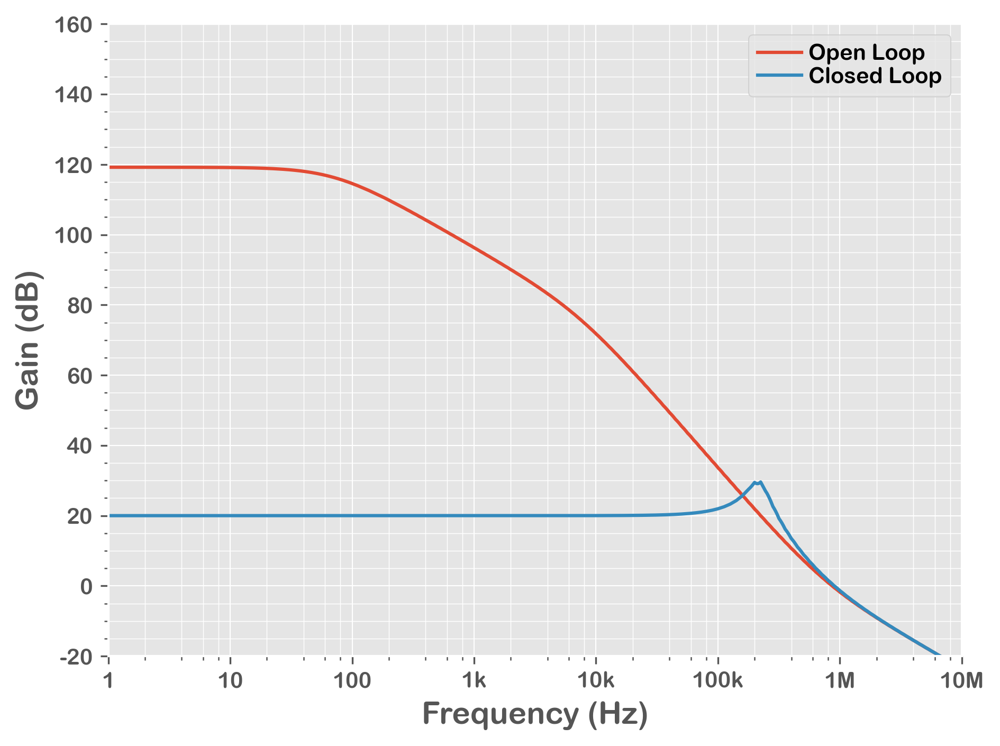

= Qorvo's QSPICE Example: P-FET LDO Open / Closed Loop Gain

== Important Note!

On Oct 6th, 2023, Python scripts are updated to utilize https://github.com/Qorvo/PyQSPICE[PyQSPICE] module.

== After Python Script

This folder contains resultng files after running the Python script.

== Overview

This p-FET LDO model compares its "open loop gain" and "closed loop gain" from the post https://www.microwavejournal.com/blogs/32-rf-signal-integrity-to-power-integrity/post/40328-every-vrm-is-a-power-amplifier-pa-of-a-special-kind[Every VRM is a Power Amplifier (PA) of a Special Kind] of a series blog/article https://www.microwavejournal.com/blogs/32-rf-signal-integrity-to-power-integrity[RF Signal Integrity to Power Integrity] on https://www.microwavejournal.com/[Microwave Journal].

== About This Simple P-FET LDO Model

This LDO is designed to have 5V output from its 0.5V reference voltage (VREF), so it's a gain=10 amplifier from the view point of the VREF.

== Simulation Outline

By thinking it as a gain=10 amplifier of VREF, the AC simulation source "Vac" is placed to the VREF in series.
Though we labeled it "Vac", we can also see it as a noise source added to the VREF.

The LC pair ("Lopen", "Copen") is working to open/close the loop. +
When "closed" @ x=0, the feedback signal from Rfb // Rg goes to the error amp "A1" as is.
When "open" @ x=1, the feedback signal from Rfb // Rg goes through this strong low-pass filter and only DC bias point set by the error mp "A1".

== Note

This is a p-FET LDO model.
The control of p-FET is "negative direction", that means the error amp "+" and "-" working in opposite way.
Though the feedback signal from Rfb // Rg goes into the "+" port, this forms a "negative feedback loop".

== Files

* We start from the schematic capture **VRM_GainBW.qsch**. +
   For your convenience, we converted the schematic into the image file **VRM_GainBW_sch.png**.

//image::https://github.com/Qorvo/QSPICE_on_MWJ/blob/main/Article2/Sim1/VRM_GainBW_sch.png[]
image::VRM_GainBW_sch.png[]

* By using the https://github.com/Qorvo/PyQSPICE[PyQSPICE] module, the Python script **VRM_GainBW.py** generates the netlist **VRM_GainBW.cir** from the schematic.

* Then the script runs the QSPICE to have the simulation data **VRM_GainBW.qraw**.

* Finally, the same script generates the output plot **VRM_GainBW_plt.png**.

//image::https://github.com/Qorvo/QSPICE_on_MWJ/blob/main/Article2/Sim1/VRM_GainBW_plt.png[]

