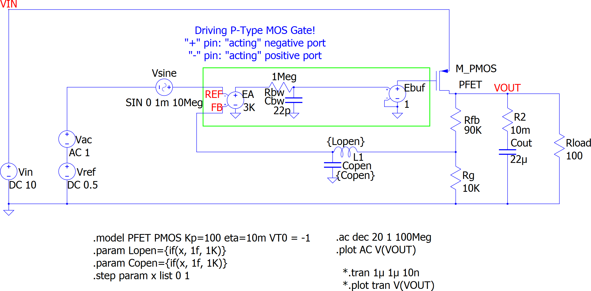

= Qorvo's QSPICE Example: P-FET LDO Open / Closed Loop Gain

== Overview

This p-FET LDO model compares its "open loop gain" and "closed loop gain".

This LDO is designed to have 5V output from its 0.5V reference voltage (VREF), so it's a gain=10 amplifier from the view point of the VREF.

By thinking it as a gain=10 amplifier of VREF, the AC simulation source "Vac" is placed to the VREF in series.
Though we labeled it "Vac", we can also see it as a noise source added to the VREF.

The LC pair ("Lopen", "Copen") is working to open/close the loop. +
When "closed" @ x=0, the feedback signal from Rfb // Rg goes to the error amp "A1" as is.
When "open" @ x=1, the feedback signal from Rfb // Rg goes through this strong low-pass filter and only DC bias point set by the error mp "A1".

== Note

This is a p-FET LDO model.
The control of p-FET is "negative direction", that means the error amp "+" and "-" working in opposite way.
Though the feedback signal from Rfb // Rg goes into the "+" port, this forms a "negative feedback loop".

== Files

1. We start from the schematic capture **VRM_GainBW.qsch**. +
   For your convenience, we converted the schematic into the image file **VRM_GainBW_sch.png**. +

2. On the QSPICE GUI, we convert the schematic into the netlist **VRM_GainBW.cir**.
3. By executing the Python script **VRM_GainBW.py**, we run the QSPICE from the netlist. +
   We need the Python library file **qspice.py** in this directory.
4. The QSPICE results in the output waveform plot **VRM_GainBW_plt.png**. +

