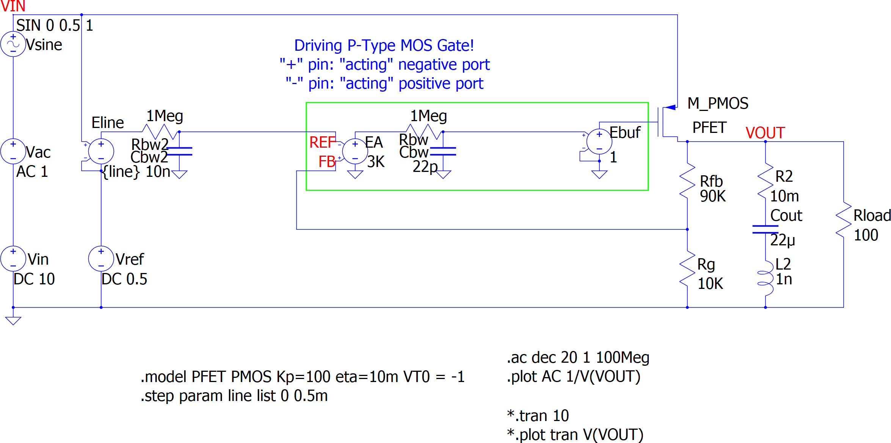

= Qorvo's QSPICE Example: P-FET LDO PSRR with Intentional Line Regulation

== Important Note!

On Oct 6th, 2023, Python scripts are updated to utilize https://github.com/Qorvo/PyQSPICE[PyQSPICE] module.

== Before Python Script

This folder contains minimum files to start the Python script.

== Overview

This p-FET LDO model illustrates that a PSRR curve at low frequency region is converging to its DC parameter "line regulation" from the post https://www.microwavejournal.com/blogs/32-rf-signal-integrity-to-power-integrity/post/40456-line-regulation-and-psrr-power-supply-ripple-rejection[Line Regulation and PSRR (Power Supply Ripple Rejection)] of a series blog/article https://www.microwavejournal.com/blogs/32-rf-signal-integrity-to-power-integrity[RF Signal Integrity to Power Integrity] on https://www.microwavejournal.com/[Microwave Journal].

== About This Simple P-FET LDO Model

This LDO is designed to have 5V output from its 0.5V reference voltage (VREF), so it's a gain=10 amplifier from the view point of the VREF.

== Simulation Outline

Both PSRR and DC-parameter-Line-Regulation share the same expression / definition:

PSRR = Line-Regulation = ΔVout / ΔVin

In many regulator devices, its reference voltage source "VREF" is depending on its supply voltage and that tiny drift of VREF is captured as line-regulation or PSRR of low frequency.

== Note

This is a p-FET LDO model.
The control of p-FET is "negative direction", that means the error amp "+" and "-" working in opposite way.
Though the feedback signal from Rfb // Rg goes into the "+" port, this forms a "negative feedback loop".

== Files

* We start from the schematic capture **VRM_PSRR_LineReg.qsch**. +
  For your convenience, we converted the schematic into the image file **VRM_PSRR_LineReg.png**.

//image::https://github.com/Qorvo/QSPICE_on_MWJ/blob/main/Article3/Sim1/VRM_PSRR_LineReg_sch.png[]

* By using the https://github.com/Qorvo/PyQSPICE[PyQSPICE] module, the Python script **VRM_PSRR_LineReg.py** generates the netlist **VRM_PSRR_LineReg.cir** from the schematic.

* Then the script runs the QSPICE to have the simulation data **VRM_PSRR_LineReg.qraw**.

* Finally, the same script generates the output plot **VRM_PSRR_LineReg.png**.

//image::https://github.com/Qorvo/QSPICE_on_MWJ/blob/main/Article3/Sim1.afterScript/VRM_PSRR_LineReg_plt.png[]

***

This example has the 2nd step.

* The script runs a regular expression routine to convert the netlist from "ac simulation" to "transient simulation", results in the 2nd netlist **VRM_PSRR_LineReg_tran.cir**.

* With the same flow as the 1st step, we have the 2nd plot **VRM_PSRR_LineReg_tran.png**.

//image::https://github.com/Qorvo/QSPICE_on_MWJ/blob/main/Article3/Sim1.afterScript/VRM_PSRR_LineReg_tran_plt.png[]
image::../Sim1.afterScript/VRM_PSRR_LineReg_tran_plt.png[]

