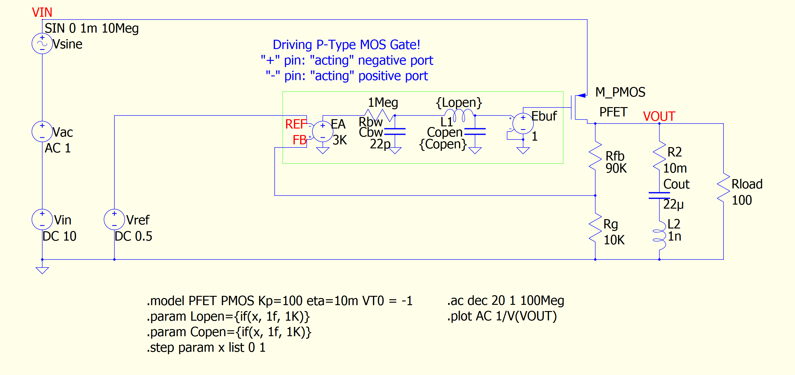
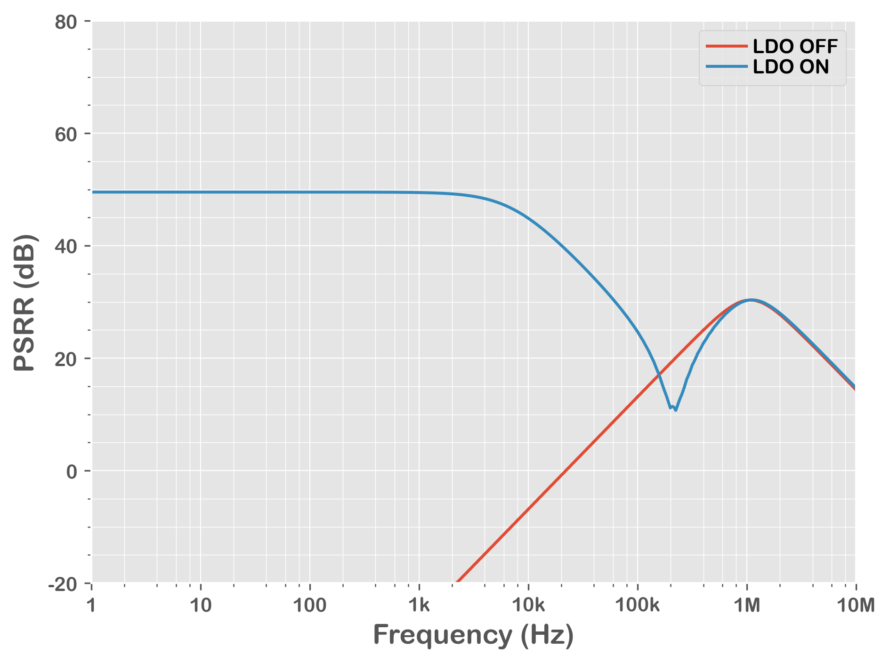

= Qorvo's QSPICE Example: P-FET LDO PSRR with LDO ON / OFF

== Important Note!

On Oct 6th, 2023, Python scripts are updated to utilize https://github.com/Qorvo/PyQSPICE[PyQSPICE] module.

== Before Python Script

This folder contains minimum files to start the Python script.

== Overview

This p-FET LDO model compares its PSRR curves with conditions "LDO ON" and "LDO OFF" from the post https://www.microwavejournal.com/blogs/32-rf-signal-integrity-to-power-integrity/post/40579-psrr-a-measure-of-the-effectiveness-of-filtering-an-upstream-supply[PSRR, A Measure of the Effectiveness of Filtering an Upstream Supply] of a series blog/article https://www.microwavejournal.com/blogs/32-rf-signal-integrity-to-power-integrity[RF Signal Integrity to Power Integrity] on https://www.microwavejournal.com/[Microwave Journal].

== About This Simple P-FET LDO Model

This LDO is designed to have 5V output from its 0.5V reference voltage (VREF), so it's a gain=10 amplifier from the view point of the VREF.

== Simulation Outline

The key point of this simulation is to illustrate the behind power/engine of VRM PSRR performance comes from the error-amp (EA).  As this EA's bandwidth fading at high frequency, the PSRR curve is identical to the output capacitor.

== Note
This is a p-FET LDO model.
The control of p-FET is "negative direction", that means the error amp "+" and "-" working in opposite way.
Though the feedback signal from Rfb // Rg goes into the "+" port, this forms a "negative feedback loop".

== Files

* We start from the schematic capture **VRM_PSRR_OnOff.qsch**. +
   For your convenience, we converted the schematic into the image file **VRM_PSRR_OnOff_sch.png**.

//image::https://github.com/Qorvo/QSPICE_on_MWJ/blob/main/Article2/Sim1/VRM_PSRR_OnOff_sch.png[]

* By using the https://github.com/Qorvo/PyQSPICE[PyQSPICE] module, the Python script **VRM_PSRR_OnOff.py** generates the netlist **VRM_PSRR_OnOff.cir** from the schematic.

* Then the script runs the QSPICE to have the simulation data **VRM_PSRR_OnOff.qraw**.

* Finally, the same script generates the output plot **VRM_PSRR_OnOff_plt.png**.

//image::https://github.com/Qorvo/QSPICE_on_MWJ/blob/main/Article2/Sim1.afterScript/VRM_PSRR_OnOff_plt.png[]

