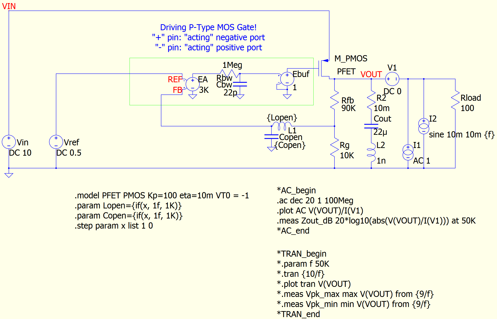
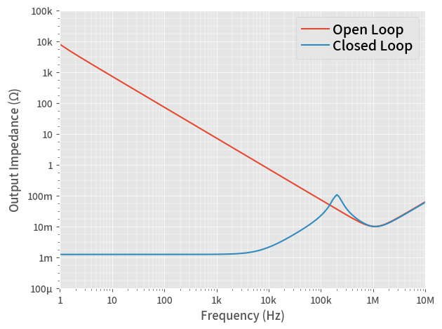
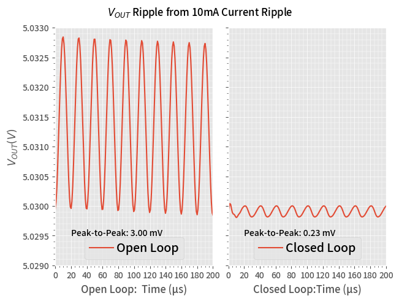

= Qorvo's QSPICE Example: P-FET LDO Z~OUT~ Open / Closed Loop

== Important Note!

On Oct 6th, 2023, Python scripts are updated to utilize https://github.com/Qorvo/PyQSPICE[PyQSPICE] module.

== Before Python Script

This folder contains minimum files to start the Python script.

== Overview

This p-FET LDO model compares its "open loop Z~OUT~" and "closed loop Z~OUT~" from the post [part7] of a series blog/article https://www.microwavejournal.com/blogs/32-rf-signal-integrity-to-power-integrity[RF Signal Integrity to Power Integrity] on https://www.microwavejournal.com/[Microwave Journal].

We double check Zout, in time-domain, by loading the LDO with a sine load current:  Zout x Iout = Vout

== About This Simple P-FET LDO Model

This LDO is designed to have 5V output from its 0.5V reference voltage (VREF), so it's a gain=10 amplifier from the view point of the VREF.

== Simulation Outline

We apply a sinusoidal / AC load current to the LDO and observe its output voltage.

Z~OUT~ = ΔV~OUT~ / ΔI~OUT~

== Note

This is a p-FET LDO model.
The control of p-FET is "negative direction", that means the error amp "+" and "-" working in opposite way.
Though the feedback signal from Rfb // Rg goes into the "+" port, this forms a "negative feedback loop".

== Files

1. We start from the schematic capture **VRM_Zout.qsch**. +
   For your convenience, we converted the schematic into the image file **VRM_Zout_sch.png**.

2. A Python script **VRM_Zout.py**, by loading the PyQSPICE module, convers the schematic file into netlist (".cir") and output (".qraw") files for both AC and Transient simualtions. +
3. Then, furthermore, this Python script reads the output binary file into its memory, as Pandas DataFrame data sets and generates plots.

***

This example has the 2nd step.

* The script runs a regular expression routine to convert the netlist from "ac simulation" to "transient simulation", results in the 2nd netlist **VRM_Zout_tran.cir**.

* With the same flow as the 1st step, we have the 2nd plot **VRM_Zout_tran_plot.png**.

//image::https://github.com/Qorvo/QSPICE_on_MWJ/blob/main/Article3/Sim1.afterScript/VRM_Zout_tran_plt.png[]

