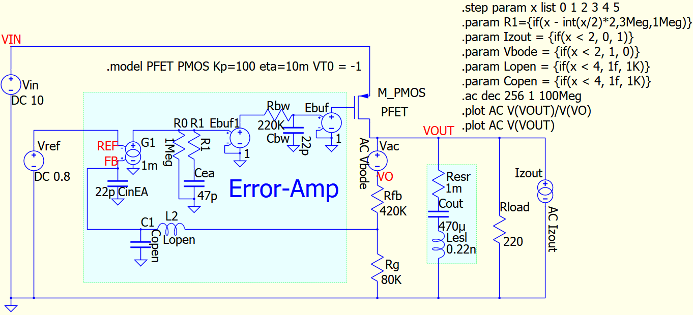
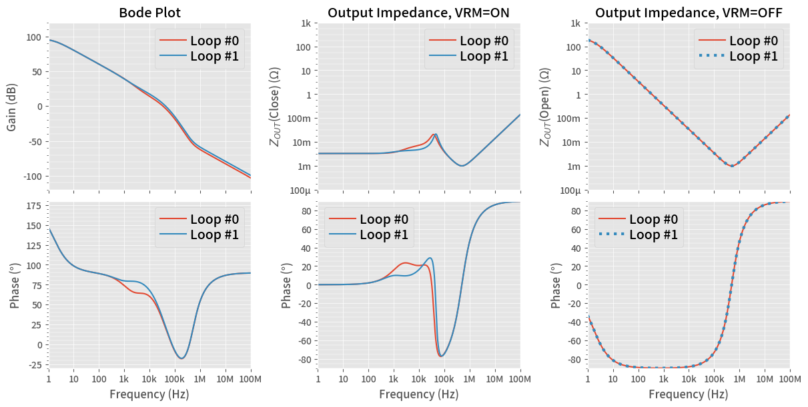
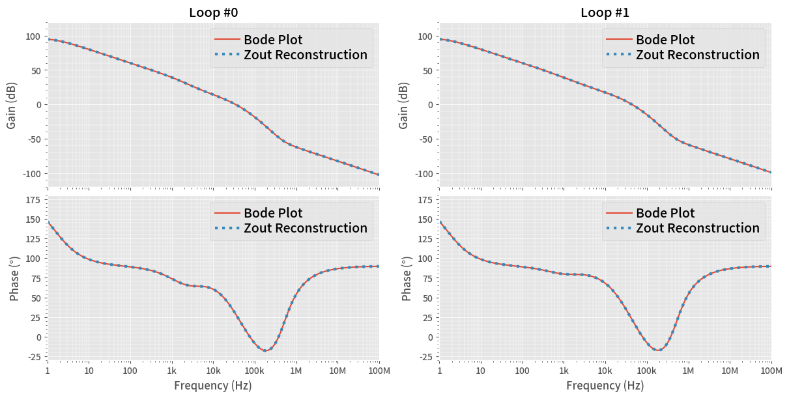
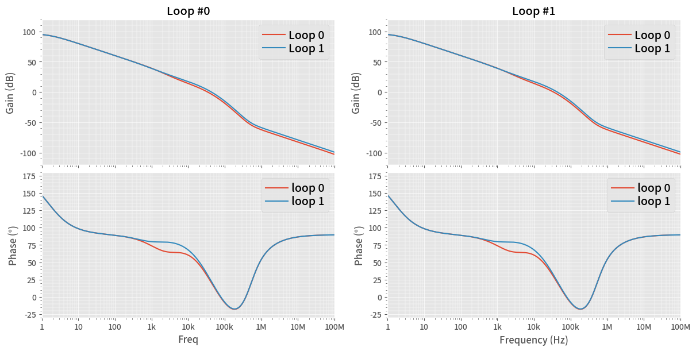
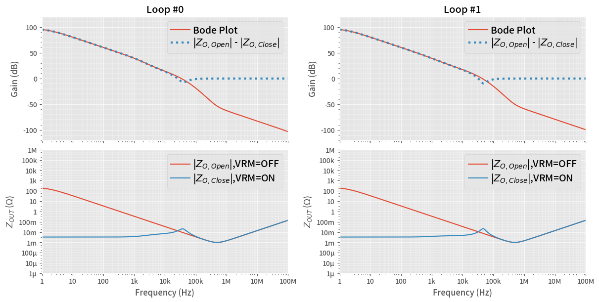

# RF Signal Integrity to Power Integrity:  Part 8

## Part 8 and 9 Combined Available

This part 8 and next part 9 share the majority of codes, please check [part 9](https://github.com/Qorvo/QSPICE_on_MWJ/tree/main/Article9) too.  
The part9 contains a part 8 and 9 combined notebook.

# Install PyQSPICE First!

In your cmd.exe window.
```
> pip install PyQSPICE
```

## Before Python Script

This folder contains minimum files to start the Python script.
The [**"Sim1.afterScript"**](https://github.com/Qorvo/QSPICE_on_MWJ/tree/main/Article8/Sim1.afterScript) folder next to this-folder is "before running script".

# Part 8 Overview

This model is an example of reconstructing the loop transfer function from its "open loop ZOUT (when VRM = OFF)" and "closed loop ZOUT (when VRM = ON)" from the post  
"part8" of a series blog/article  
[RF Signal Integrity to Power Integrity](https://www.microwavejournal.com/blogs/32-rf-signal-integrity-to-power-integrity) on  
[Microwave Journal](https://www.microwavejournal.com/).


# Bode-Plot, Nyquist-Diagram, Output-Impedance Open/Closed, Reconstructing Loop from Zout(open/close), NISM

By using an LDO model, we see various ways of loop stability checking methods in one place.
This simulation schematic runs 6 ".AC" steps as shown below.

|              | Bode Plot | Zout(closed)     | Zout(open)       |
|--------------|-----------|------------------|------------------|
| Error Amp 1  | Step = 0  | Step = 2         | Step = 4         |
| Error Amp 2  | Step = 1  | Step = 3         | Step = 5         |

* Simulations for Bode Plots (Step = 0, 1) give us Bode Plots for pairs of (phase margin, gain margin),
  also we can generate Nyquist diagrams.
* Simulations for Output Impedance "Closed Loop" give us Q-Factor shape of the loop,
  and we can get Tg curves.  Then, we can run NISM.
* Simulations for Output Impeance "Open Loop" give us a capability to reconstruct the loop transfer function by comparing with the "Closed Loop" counter part.

> NOTE:  NISM is very accurate with 2nd order system..., this LDO model/DUT is not 2nd order but has more...as I can get nicer looking Nyquist diagrams.

## 1. Run a Simulation

After running below block of code, we have the simulation result in a Pandas DataFrame **df0**.




```python
from PyQSPICE import clsQSPICE as pqs

import subprocess
import math
import cmath
import pandas as pd
import matplotlib as mpl
import matplotlib.pyplot as plt
from numpy import sin, cos, pi, linspace

fname = "VRM_ZoPart8"

run = pqs(fname)

run.InitPlot()

run.qsch2cir()
run.cir2qraw()

run.setNline(2048)

g = "V(VOUT)/V(VO)"
z = "V(VOUT)"

df0 = run.LoadQRAW([g, z])
print(df0)
```

                   Freq               V(VOUT)/V(VO)             V(VOUT)  Step
    0      1.000000e+00 -46857.377758+30464.634818j  0.999985-0.000010j     0
    1      1.009035e+00 -46606.098908+30575.157244j  0.999985-0.000010j     0
    2      1.018152e+00 -46353.010742+30683.993109j  0.999985-0.000010j     0
    3      1.027351e+00 -46098.135037+30791.106635j  0.999985-0.000010j     0
    4      1.036633e+00 -45841.494461+30896.462305j  0.999985-0.000010j     0
    ...             ...                         ...                 ...   ...
    12289  9.646616e+07      1.000000+    0.000000j  0.001081+0.133340j     5
    12290  9.733774e+07      1.000000+    0.000000j  0.001082+0.134545j     5
    12291  9.821719e+07      1.000000+    0.000000j  0.001084+0.135761j     5
    12292  9.910459e+07      1.000000+    0.000000j  0.001085+0.136988j     5
    12293  1.000000e+08      1.000000+    0.000000j  0.001087+0.138225j     5
    
    [12294 rows x 4 columns]
    

## 2. Re-arranging DataFrame

The QSPICE returns its result in a "tall format" of 12294 lines/rows.
We re-arrange it into the 2x3 format just like a table at the top of this document.
Then, we calcuate/add gain and phase into the DataFrame.

### 2.1 Reconstructing Loop Transfer Function

Also, we calcuate the loop from Zout(closed) and Zout(open).


```python
df = df0[df0.Step <= 1].reset_index(drop=True)
df = run.GainPhase(df, g, "gain", "phase", "reGain", "imGain", -1)

df["Zout(Closed)"] = df0.query('Step == 2 or Step == 3').reset_index(drop=True).loc[:,"V(VOUT)"]
df["Zout(Open)"] = df0.query('Step == 4 or Step == 5').reset_index(drop=True).loc[:,"V(VOUT)"]

def CalcZ(row):
    row["T"] = 1 - row["Zout(Open)"] / row["Zout(Closed)"]
    return row
df = df.apply(CalcZ, axis=1)

df = run.GainPhase(df, "T", "abs(Tzo)", "arg(Tzo)")
df = run.GainPhase(df, "Zout(Closed)", "abs(Zoc)", "arg(Zoc)")
df = run.GainPhase(df, "Zout(Open)", "abs(Zoo)", "arg(Zoo)")
run.comp2real(df, ["Step", "reGain", "imGain", "gain", "phase", "abs(Tzo)", "arg(Tzo)", "abs(Zoc)", "arg(Zoc)", "abs(Zoo)", "arg(Zoo)", run.sim['Xlbl']])

print(df)
```

                  Freq               V(VOUT)/V(VO)             V(VOUT)  Step  \
    0     1.000000e+00 -46857.377758+30464.634818j  0.999985-0.000010j   0.0   
    1     1.009035e+00 -46606.098908+30575.157244j  0.999985-0.000010j   0.0   
    2     1.018152e+00 -46353.010742+30683.993109j  0.999985-0.000010j   0.0   
    3     1.027351e+00 -46098.135037+30791.106635j  0.999985-0.000010j   0.0   
    4     1.036633e+00 -45841.494461+30896.462305j  0.999985-0.000010j   0.0   
    ...            ...                         ...                 ...   ...   
    4093  9.646616e+07      0.000000+    0.000011j -0.000000-0.000011j   1.0   
    4094  9.733774e+07      0.000000+    0.000011j -0.000000-0.000011j   1.0   
    4095  9.821719e+07      0.000000+    0.000011j -0.000000-0.000011j   1.0   
    4096  9.910459e+07      0.000000+    0.000011j -0.000000-0.000011j   1.0   
    4097  1.000000e+08      0.000000+    0.000011j -0.000000-0.000011j   1.0   
    
               gain       phase        reGain        imGain        Zout(Closed)  \
    0     94.946704  146.969824  4.685738e+04 -30464.634818  0.003301+0.000001j   
    1     94.923369  146.733788  4.660610e+04 -30575.157244  0.003301+0.000001j   
    2     94.899738  146.496902  4.635301e+04 -30683.993109  0.003301+0.000001j   
    3     94.875810  146.259180  4.609814e+04 -30791.106635  0.003301+0.000001j   
    4     94.851582  146.020636  4.584149e+04 -30896.462305  0.003301+0.000001j   
    ...         ...         ...           ...           ...                 ...   
    4093 -99.009700   89.620961 -7.414353e-08     -0.000011  0.001079+0.133341j   
    4094 -99.092293   89.623768 -7.289787e-08     -0.000011  0.001081+0.134545j   
    4095 -99.174969   89.626546 -7.167428e-08     -0.000011  0.001082+0.135761j   
    4096 -99.257730   89.629293 -7.047238e-08     -0.000011  0.001084+0.136988j   
    4097 -99.340578   89.632010 -6.929178e-08     -0.000011  0.001085+0.138225j   
    
                      Zout(Open)                           T   abs(Tzo)  \
    0     154.691376-100.423370j -46854.103289+30439.312500j  94.944132   
    1     153.862919-100.788446j -46602.989790+30549.970314j  94.920811   
    2     153.028492-101.147962j -46350.066565+30658.942957j  94.897194   
    3     152.188166-101.501800j -46095.355340+30766.194661j  94.873280   
    4     151.342015-101.849843j -45838.878735+30871.689911j  94.849066   
    ...                      ...                         ...        ...   
    4093    0.001081+  0.133340j      0.000000+    0.000012j -98.767631   
    4094    0.001082+  0.134545j      0.000000+    0.000011j -98.845766   
    4095    0.001084+  0.135761j      0.000000+    0.000011j -98.923902   
    4096    0.001085+  0.136988j      0.000000+    0.000011j -99.002038   
    4097    0.001087+  0.138225j      0.000000+    0.000011j -99.080174   
    
            arg(Tzo)   abs(Zoc)   arg(Zoc)   abs(Zoo)   arg(Zoo)  
    0     146.989764 -49.627651   0.018636  45.316612 -32.991041  
    1     146.753688 -49.627651   0.018804  45.293291 -33.226944  
    2     146.516762 -49.627651   0.018974  45.269674 -33.463695  
    3     146.279001 -49.627651   0.019146  45.245759 -33.701280  
    4     146.040417 -49.627651   0.019319  45.221546 -33.939685  
    ...          ...        ...        ...        ...        ...  
    4093   89.618596 -17.500474  89.536232 -17.500475  89.535572  
    4094   89.621381 -17.422349  89.539760 -17.422350  89.539105  
    4095   89.624136 -17.344224  89.543250 -17.344225  89.542602  
    4096   89.626860 -17.266100  89.546704 -17.266100  89.546061  
    4097   89.629554 -17.187975  89.550121 -17.187976  89.549484  
    
    [4098 rows x 17 columns]
    

> ***Note*** that the gain calculation of "df = df.apply()" makes everything "complex".  So we re-convert known "non-complex" data to "real".

## 3. Plot All 6 Original Steps


```python
# Prepare a blank plotting area
plt.close('all')
fig, ax = plt.subplots(2,3,sharex=True,constrained_layout=True,figsize=(12,6))

# Bode Plots
# Position: Upper Left [0,0], Gain
df[df.Step == 0].plot(ax=ax[0,0], x="Freq",  y="gain", label="Loop #0")
df[df.Step == 1].plot(ax=ax[0,0], x="Freq",  y="gain", label="Loop #1")
run.PrepFreqGainPlot(ax[0,0], "", "Gain (dB)", [], [-120,120], "Bode Plot")

# Position: Lower Left [1,0], Phase
df[df.Step == 0].plot(ax=ax[1,0], x="Freq",  y="phase", label="Loop #0")
df[df.Step == 1].plot(ax=ax[1,0], x="Freq",  y="phase", label="Loop #1")
run.PrepFreqGainPlot(ax[1,0], "Frequency (Hz)", "Phase (°)", [], [-30,180])

# Output-Impedance, Closed-Loop
# Position: Upper Center [0,1], |abs|
df[df.Step == 0].plot(ax=ax[0,1], x="Freq",  y="abs(Zoc)", label="Loop #0")
df[df.Step == 1].plot(ax=ax[0,1], x="Freq",  y="abs(Zoc)", label="Loop #1")
#run.PrepFreqGainPlot(ax[0,1], "", r'$Z_{OUT}$(Close) (dB $\Omega$)', [], [-80,60], "Output Impedance, VRM=ON")
run.PrepFreqImpePlot(ax[0,1], "", r'$Z_{OUT}$(Close) ($\Omega$)', [], [-80,60], "Output Impedance, VRM=ON")

# Position: Lower Center [1,1], Phase
df[df.Step == 0].plot(ax=ax[1,1], x="Freq",  y="arg(Zoc)", label="Loop #0")
df[df.Step == 1].plot(ax=ax[1,1], x="Freq",  y="arg(Zoc)", label="Loop #1")
run.PrepFreqGainPlot(ax[1,1], "Frequency (Hz)", "Phase (°)", [], [-90,90])

# Output-Impedance, Open-Loop
# Position: Upper Right [0,2], |abs|
df[df.Step == 0].plot(ax=ax[0,2], x="Freq",  y="abs(Zoo)", label="Loop #0")
df[df.Step == 1].plot(ax=ax[0,2], x="Freq",  y="abs(Zoo)", label="Loop #1",linestyle="dotted",linewidth=3)
#run.PrepFreqGainPlot(ax[0,2], "", r'$Z_{OUT}$(Open) (dB $\Omega$)', [], [-80,60], "Output Impedance, VRM=OFF")
run.PrepFreqImpePlot(ax[0,2], "", r'$Z_{OUT}$(Open) ($\Omega$)', [], [-80,60], "Output Impedance, VRM=OFF")

# Position: Lower Right [1,2], Phase
df[df.Step == 0].plot(ax=ax[1,2], x="Freq",  y="arg(Zoo)", label="Loop #0")
df[df.Step == 1].plot(ax=ax[1,2], x="Freq",  y="arg(Zoo)", label="Loop #1",linestyle="dotted",linewidth=3)
run.PrepFreqGainPlot(ax[1,2], "Frequency (Hz)", "Phase (°)", "auto", [-90,90])     # with "sharex=True", this "last" xlim controls x-label!

run.tstime(['png'])
plt.savefig(run.path['png'], format='png', bbox_inches='tight')

plt.show()
plt.close('all')
```


    

    


## 4. Comparison:  Original Bode Plot vs Zout-Reconstruction

Note: We already re-constructed the loop function at the step "2.1" above.


```python
# Prepare a blank plotting area
fig, ax = plt.subplots(2,2,sharex=True,constrained_layout=True,figsize=(12,6))

for i in [0, 1]:
    df[df.Step == i].plot(ax=ax[0,i], x="Freq",  y="gain", label="Bode Plot")
    df[df.Step == i].plot(ax=ax[0,i], x="Freq",  y="abs(Tzo)", label="Zout Reconstruction", linestyle="dotted", linewidth=3)
    run.PrepFreqGainPlot(ax[0,i], "", "Gain (dB)", [], [-120,120], f'Loop #{i}')
    
    df[df.Step == i].plot(ax=ax[1,i], x="Freq",  y="phase", label="Bode Plot")
    df[df.Step == i].plot(ax=ax[1,i], x="Freq",  y="arg(Tzo)", label="Zout Reconstruction", linestyle="dotted", linewidth=3)
    run.PrepFreqGainPlot(ax[1,i], "Frequency (Hz)", "Phase (°)", "auto", [-30,180], "")

plt.savefig("PltTs0.png", format='png', bbox_inches='tight')

plt.show()
plt.close('all')

```


    

    


Above plotting is "per Loop #".  We plot the same curves per "original Bode" and "Re-construction by Zout".


```python
# Prepare a blank plotting area
fig, ax = plt.subplots(2,2,sharex=True,constrained_layout=True,figsize=(12,6))

ax[0,0].set_title('Bode Plot', fontsize=14)
ax[0,1].set_title('Zout Reconstruction', fontsize=14)

for i in [0, 1]:
    df[df.Step == i].plot(ax=ax[0,0], x="Freq",  y="gain", label=f"Loop {i}")
    df[df.Step == i].plot(ax=ax[0,1], x="Freq",  y="abs(Tzo)", label=f"Loop {i}")
    run.PrepFreqGainPlot(ax[0,i], "", "Gain (dB)", [], [-120,120], f'Loop #{i}')

    df[df.Step == i].plot(ax=ax[1,0], x="Freq",  y="phase", label=f"loop {i}")
    df[df.Step == i].plot(ax=ax[1,1], x="Freq",  y="arg(Tzo)", label=f"loop {i}")
    run.PrepFreqGainPlot(ax[1,i], "Frequency (Hz)", "Phase (°)", "auto", [-30,180], "")

plt.savefig("PltTs1.png", format='png', bbox_inches='tight')

plt.show()
plt.close('all')

```


    

    


# 4.1 Simple-Math Version


```python

df00 = df.loc[:,["Step","Freq","abs(Zoo)"]].rename(columns = {"abs(Zoo)": "dZo"}) - df.loc[:,["Step","Freq","abs(Zoc)"]].rename(columns={"abs(Zoc)": "dZo"})
#print(df.loc[:,["abs(Zoo)"]].rename(columns = {"abs(Zoo)": "a"}))
#print(df[df.Step == 0].loc[:,["abs(Zoc)"]].rename(columns={"abs(Zoc)": "a"})
df00["Freq"] = df.loc[:,"Freq"]
df00["Step"] = df.loc[:,"Step"]
print(df00)
# Prepare a blank plotting area
fig, ax = plt.subplots(2,2,sharex=True,constrained_layout=True,figsize=(12,6))

for i in [0, 1]:
#if 0:
    df[df.Step == i].plot(ax=ax[0,i], x="Freq",  y="gain", label="Bode Plot")
    df00[df00.Step == i].plot(ax=ax[0,i], x="Freq",  y="dZo", label=r"|$Z_{O,Open}$| - |$Z_{O,Close}$|", linestyle="dotted", linewidth=3)
    run.PrepFreqGainPlot(ax[0,i], "", "Gain (dB)", [], [-120,120], f'Loop #{i}')

    df[df.Step == i].plot(ax=ax[1,i], x="Freq",  y="abs(Zoo)", label=r"|$Z_{O,Open}$|,VRM=OFF")
    df[df.Step == i].plot(ax=ax[1,i], x="Freq",  y="abs(Zoc)", label=r"|$Z_{O,Close}$|,VRM=ON")
    run.PrepFreqImpePlot(ax[1,i], "Frequency (Hz)", r"$Z_{OUT}$ ($\Omega$)", "auto", [-120,120], "")

plt.savefig("PltTs2.png", format='png', bbox_inches='tight')

plt.show()
plt.close('all')

```

          Step          Freq           dZo
    0      0.0  1.000000e+00  9.494426e+01
    1      0.0  1.009035e+00  9.492094e+01
    2      0.0  1.018152e+00  9.489732e+01
    3      0.0  1.027351e+00  9.487341e+01
    4      0.0  1.036633e+00  9.484920e+01
    ...    ...           ...           ...
    4093   1.0  9.646616e+07 -6.657570e-07
    4094   1.0  9.733774e+07 -6.549778e-07
    4095   1.0  9.821719e+07 -6.443908e-07
    4096   1.0  9.910459e+07 -6.339926e-07
    4097   1.0  1.000000e+08 -6.237797e-07
    
    [4098 rows x 3 columns]
    


    

    

