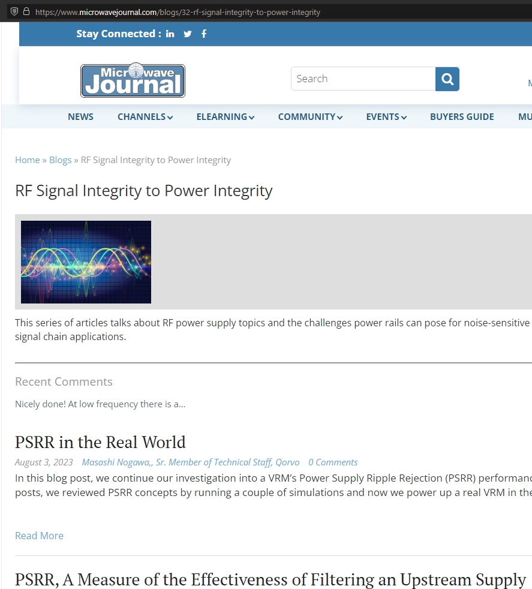

= Qorvo's QSPICE Examples from https://www.microwavejournal.com/blogs/32-rf-signal-integrity-to-power-integrity[RF Signal Integrity to Power Integrity] series blog/article

== Overview
This repository offers examples used in a series blog/articles on https://www.microwavejournal.com/[Microwave Journal (MWJ)] written by a Qorvo engineer https://www.microwavejournal.com/authors/5278-masashi-nogawa-sr-member-of-technical-staff-qorvo[Masashi Nogawa].

***

***

We have following kind of example files in sub-directories, sorted by the article number of the series.

* QSPICE simulation decks / schematics (**.qsch**)
* Netlist files (**.cir**) for QSPICE from the **.qsch** schematics (above).
* Result data files (**.qraw**) from the QSPICE simulation runs.
* Python scripts (**.py**) as a QSPICE manipulation interface / wrapper.
* https://jupyter.org[Jupyter Lab] notebooks (**.ipynb**) as an interactive execution of QSPICE-PyQSPICE.

== About QSPICE
Qorvo offers a free simulation tool QSPICE, that is a very fast running SPICE.
On this QSPICE platform, Qorvo keeps offering simulation models of power management ICs and power SiC transistor devices (products of, formerly known as, UnitedSiC).

QSPICE is available from https://www.qorvo.com/design-hub/design-tools/interactive/qspice[this URL] for free.

== About PyQSPICE
Qorvo offers a Python (language) module, called https://github.com/Qorvo/PyQSPICE[PyQSPICE].
All the examples in this repository are using PyQSPICE on their background.

At a high level, PyQSPICE module does following operations.

* Starting from a schematic (**.qsch**) or netlist (**.cir**) files, it generates a simulation result file by invoking QSPICE executable (**.exe**) files.
* From a result data (**.qraw**) file, it takes the simulation data into a https://pandas.pydata.org[Pandas] https://pandas.pydata.org/docs/reference/api/pandas.DataFrame.html[DataFrame].

Once a DataFrame is loaded, a per-example Python script can manipulate the DataFrame for plotting, for example "V(R1) / I(R1)", and plot the data with the https://matplotlib.org[matplotlib].

For example, a Nyquist diagram like this...

image::https://github.com/Qorvo/PyQSPICE/blob/be2fc3f600ba9d543223423d104355a425a8f0ec/images/output_Nyq_1.png?raw=True[]

== Licenses of examples in this repository
NOTE: Please kindly let us know when you find other licenses to be mentioned here.

* The QSPICE files of file-extensions ".qsch", ".cir" and ".qraw" are under the https://github.com/Qorvo/QSPICE_on_MWJ/blob/main/LICENSE[license of Qorvo].
* The Python script codes of file-extension ".py", writtne by Qorvo, are also under the https://github.com/Qorvo/QSPICE_on_MWJ/blob/main/LICENSE[license of Qorvo].

..end of README

