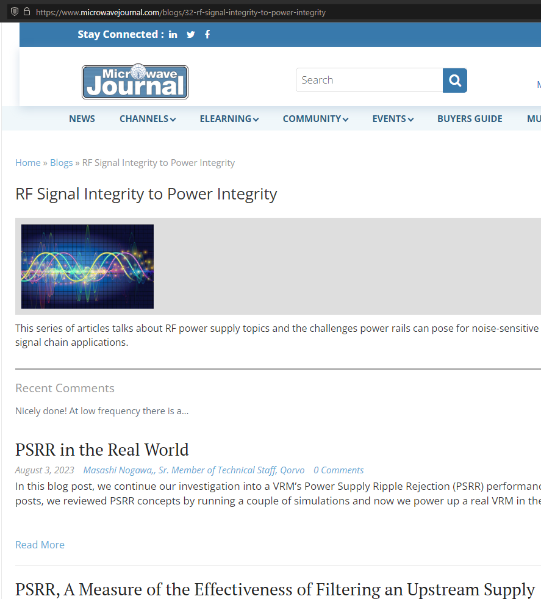

= Qorvo's QSPICE Examples from https://www.microwavejournal.com/blogs/32-rf-signal-integrity-to-power-integrity[RF Signal Integrity to Power Integrity] series blog/article

== Overview
This repository offers examples used in a series blog/articles on https://www.microwavejournal.com/[Microwave Journal (MWJ)] written by a Qorvo engineer https://www.microwavejournal.com/authors/5278-masashi-nogawa-sr-member-of-technical-staff-qorvo[Masashi Nogawa].

***

***

We have following kind of example files in sub-directories, sorted by the article number of the series.

* QSPICE simulation decks / schematics (**.qsch**)
* Netlist files (**.cir**) for QSPICE from the **.qsch** schematics (above).
* Result data files (**.qraw**) from the QSPICE simulation runs.
* Python scripts (**.py**) as a QSPICE manipulation interface / wrapper.
* https://jupyter.org[Jupyter Lab] notebooks (**.ipynb**) as an interactive execution of QSPICE-PyQSPICE.

== About QSPICE
Qorvo offers a free simulation tool QSPICE, that is a very fast running SPICE.
On this QSPICE platform, Qorvo keeps offering simulation models of power management ICs and power SiC transistor devices (products of, formerly known as, UnitedSiC).

QSPICE is available from https://www.qorvo.com/design-hub/design-tools/interactive/qspice[this URL] for free.

== About PyQSPICE
Qorvo offers a Python (language) module, called https://github.com/Qorvo/PyQSPICE[PyQSPICE].
All the examples in this repository are using PyQSPICE on their background.

At a high level, PyQSPICE module does following operations.

* Starting from a schematic (**.qsch**) or netlist (**.cir**) files, it generates a simulation result file by invoking QSPICE executable (**.exe**) files.
* From a result data (**.qraw**) file, it takes the simulation data into a https://pandas.pydata.org[Pandas] https://pandas.pydata.org/docs/reference/api/pandas.DataFrame.html[DataFrame].

Once a DataFrame is loaded, a per-example Python script can manipulate the DataFrame for plotting, for example "V(R1) / I(R1)", and plot the data with the https://matplotlib.org[matplotlib].

For example, a Nyquist diagram like this...

image::https://github.com/Qorvo/PyQSPICE/blob/be2fc3f600ba9d543223423d104355a425a8f0ec/images/output_Nyq_1.png?raw=True[]

== Licenses of examples in this repository
NOTE: Please kindly let us know when you find other licenses to be mentioned here.

* The QSPICE files of file-extensions ".qsch", ".cir" and ".qraw" are under the https://github.com/Qorvo/QSPICE_on_MWJ/blob/main/LICENSE[license of Qorvo].
* The Python script codes of file-extension ".py", writtne by Qorvo, are also under the https://github.com/Qorvo/QSPICE_on_MWJ/blob/main/LICENSE[license of Qorvo].

..end of README

Update README.md with minimal ethics#1#101

What about the application of the Solomonoff induction to the RF sensing of human brain?
https://en.wikipedia.org/wiki/Talk:Solomonoff%27s_theory_of_inductive_inference

    If we assume that the algorithmic complexity of neural processes is relatively small
    (you could take a look at the Potapov monography
    for some arguments)

    As far as I know a lot of neural processes in human brain are electric (or electro-chemistry) in nature. They have a little power and a small
    frequency (~ 1-1000 Hz).
    So they emit very low frequency radio waves.

    You can detect those radio waves on small antennas if the impedance of such antennas
    is matched. This is basically the citation
    from the book on electrodynamics.
    I uploaded one such book on Twirpix site.

    So you can create a lot of such receivers

    microstrip filter to filter very high frequencies
    impedance matched microstrip antenna
    resistor for noise for oversampling
    very fast comparator to sample signal in a very large array on a chip using
    standard CMOS or some sort of full-custom process
    (maybe even with some new materials)

    BreamForming and large arrays of digital correlators with sub-mm positioning accuracy could be achived.

so it seems there is no theoretical
obstacles to implement some sort of
RF human brain sensing or even control
if you can implement reverse structure
with array of a large amount of RF amplifiers
with sub-mm beam forming accuracy

BTW I wrote that remark:
https://en.wikipedia.org/wiki/Talk:Solomonoff%27s_theory_of_inductive_inference

What about the application of the Solomonoff induction to the person to person information exchange?

It seems the minimum description length principle could be used to deduce minimum ethics. At least you can compare ethics by the length. What about the following question: how to shoot met-art girl in the dark underground? ~2026-24709-41 (talk) 16:43, 8 June 2026 (UTC)

at least we can ask a question: does russian met-art model from a pic want some money? and what obstacles do that guess so hard?
why it is so hard to contact her directly?
she lose money, interesting person lose opportunity to make some photos.

also, it seems the economy without coordination primitives based on physics or mathematics like gold or maybe Bitcoin or maybe some sort of other physical objects or processes is just a chaos.
Economic calculation based on fiat money is impossible just from scientific methodology https://en.wikipedia.org/wiki/Talk:Solomonoff%27s_theory_of_inductive_inference

https://transitional-writes.dreamwidth.org/44972.html Kirill Abramovich aka wieker @ linux.org.ru
Samara, Russia

and the most important question:
what about the minimal ethics deduced from the MDL principle? is it exist?

what was the obstacle between russian met-art girls and engineers?

